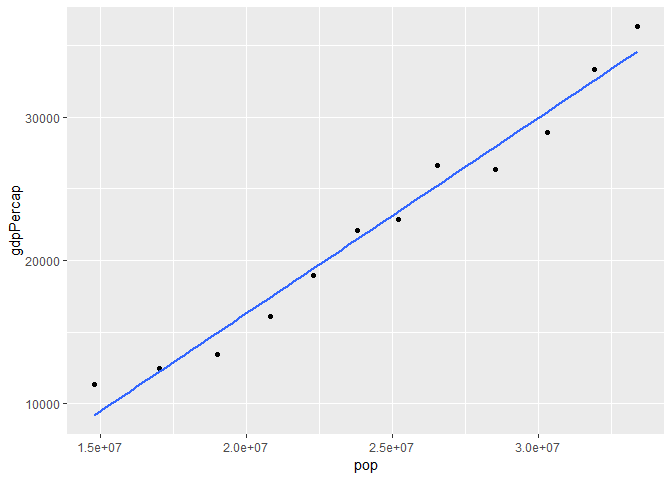
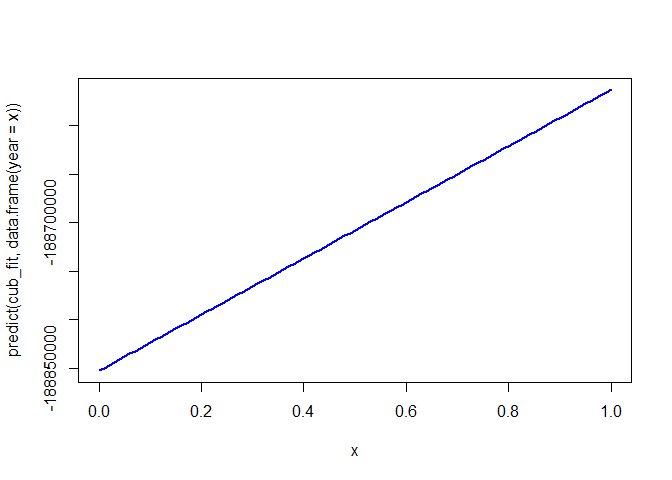

```r
suppressPackageStartupMessages(library(gapminder))
suppressPackageStartupMessages(library(tidyverse))
suppressPackageStartupMessages(library(ggplot2)) 
suppressPackageStartupMessages(library(dplyr))
suppressPackageStartupMessages(library(MASS))
suppressPackageStartupMessages(library(singer))
suppressPackageStartupMessages(library(ggmap))
suppressPackageStartupMessages(library(singer)) 
```


# Task 1 Character Data

In this task, I have read and worked the exercises in the __Strings chapter__ or R for Data Science.

First we will load the library needed for this exercise


```r
suppressPackageStartupMessages(library(tidyverse))
library(stringr)
```

## 14.2.5 Exrercise 

1. In code that doesn’t use stringr, you’ll often see `paste()` and `paste0()`. What’s the difference between the two functions? What stringr function are they equivalent to? How do the functions differ in their handling of NA?

We try to see the difference of these two functions by simple examples.

```r
paste("Merry","Christmas")
```

```
## [1] "Merry Christmas"
```

```r
paste0("Merry","Christmas")
```

```
## [1] "MerryChristmas"
```
We can clearly see that if we use `paste()` to combine two strings, it will return a combined string with a space in between each string, while using `paste0()` return a combined string with no space in between.

The `paste0()` is equavalent to the `str_c()` function, we can prove this by the following example:
we first use the function `paste0()` and also look at the structure of the result.

```r
(ex1 <- paste0("hello","world"))
```

```
## [1] "helloworld"
```

```r
str(ex1)
```

```
##  chr "helloworld"
```
Then we perform the same thing with `str_c()`, which return the same result with the same structure.

```r
(ex2 <- str_c("hello","world"))
```

```
## [1] "helloworld"
```

```r
str(ex2)
```

```
##  chr "helloworld"
```

To get the equavalent results with the function `paste()`, we can perform it with the `str_c()` function again:
Here is the `paste()`

```r
(ex3 <- paste("hello","world"))
```

```
## [1] "hello world"
```

```r
str(ex3)
```

```
##  chr "hello world"
```
And now compare with the `str_c()`, separated with a space

```r
(ex4 <- str_c("hello","world", sep = " "))
```

```
## [1] "hello world"
```

```r
str(ex4)
```

```
##  chr "hello world"
```

Handle with NA:

While using `paste()` and `paste0()`, in this case it returns a string with the NA append to it.

```r
paste("hello","world",NA)
```

```
## [1] "hello world NA"
```

```r
paste0("hello","world", NA)
```

```
## [1] "helloworldNA"
```
If we put the NA at the front of the string, it has the similar results

```r
paste(NA,"hello","world")
```

```
## [1] "NA hello world"
```

```r
paste0(NA,"hello","world")
```

```
## [1] "NAhelloworld"
```

For `str_c()` function, the result is shown below:

```r
str_c("hello","world", NA,sep = " ")
```

```
## [1] NA
```

```r
str_c(NA,"hello","world", sep = " ")
```

```
## [1] NA
```
If there is one string which is NA, then the `str_c()` function will return the NA.


2. In your own words, describe the difference between the `sep` and `collapse` arguments to `str_c()`
In brief, `collapse` is used to combined vectors of strings while `sep` is used to combined two or more strings. This can be better illustrated by an example.

```r
str_c(c("a", "b", "c"), collapse= "&")
```

```
## [1] "a&b&c"
```

```r
str_c("a","b","c",sep= ",")
```

```
## [1] "a,b,c"
```
we can also use `collapse` and `sep` together:
by repeating the string `apple` and combined it with each element in the vector.

```r
str_c(c("I","He","She"), "apple",  sep= " ate ", collapse = " & " )
```

```
## [1] "I ate apple & He ate apple & She ate apple"
```

3. Use str_length() and str_sub() to extract the middle character from a string. What will you do if the string has an even number of characters?
we can use some simple maths to achieve this:
for odd number:

```r
num <- str_length("paparazzi")
str_sub("paparazzi",ceiling(num/2),ceiling(num/2))
```

```
## [1] "r"
```
for even number:

```r
num1 <- str_length("baseball")
str_sub("baseball",(num1/2), (num1/2+1))
```

```
## [1] "eb"
```
This will return the middle 2 characters.


## 14.3.1.1 Exercises

1. Explain why each of these strings don’t match a \: "\", "\\", "\\\".
To explore this, we can look at the below example, so a single "\" don't match since a single backslash symbol is used to escape special behaviour.
Since \ is used as the escape character, then first we need to use a \ to escape it to form a regular expression \\. Then if we create a string we need to use the escape \ again. So overall we will need 4 backslashs


```r
str_view(c("abc", "a.c", "a\\c","\\"), "\\\\")
```

<!--html_preserve--><div id="htmlwidget-b198e4043a07616c79f9" style="width:960px;height:100%;" class="str_view html-widget"></div>
<script type="application/json" data-for="htmlwidget-b198e4043a07616c79f9">{"x":{"html":"<ul>\n  <li>abc<\/li>\n  <li>a.c<\/li>\n  <li>a<span class='match'>\\<\/span>c<\/li>\n  <li><span class='match'>\\<\/span><\/li>\n<\/ul>"},"evals":[],"jsHooks":[]}</script><!--/html_preserve-->
so in breif, `\\` for the normal expression `\`, then extra `\` to escape the special function, then last `\` used to create a new string, then overall 4 `\`.

2.How would you match the sequence "'\?
first we create a string with this sequence, then we try to match it:

```r
x <- "\"\'\\"
writeLines(x)
```

```
## "'\
```

```r
str_view(x, "\\\"\\'\\\\") 
```

<!--html_preserve--><div id="htmlwidget-dc3f981b35162e544194" style="width:960px;height:100%;" class="str_view html-widget"></div>
<script type="application/json" data-for="htmlwidget-dc3f981b35162e544194">{"x":{"html":"<ul>\n  <li><span class='match'>\"'\\<\/span><\/li>\n<\/ul>"},"evals":[],"jsHooks":[]}</script><!--/html_preserve-->
the first three backslash is to escape the special behabiour of " and create a string, then middle 2 is for the string `'` and the last 4 backslashs are used to create `\`.

## 14.3.2.1 Exercises

1, How would you match the literal string "$^$"?
again, first we create the string: ```
each `\\` is used to create the string and escape its special functions.

```r
x1 <- "$^$"
writeLines(x1)
```

```
## $^$
```

```r
str_view(x1, "\\$\\^\\$")
```

<!--html_preserve--><div id="htmlwidget-d414e99c5a8f747042c9" style="width:960px;height:100%;" class="str_view html-widget"></div>
<script type="application/json" data-for="htmlwidget-d414e99c5a8f747042c9">{"x":{"html":"<ul>\n  <li><span class='match'>$^$<\/span><\/li>\n<\/ul>"},"evals":[],"jsHooks":[]}</script><!--/html_preserve-->

2. Given the corpus of common words in stringr::words, create regular expressions that find all words that:

* Start with “y”.


```r
str_view(stringr::words, pattern = "^y", match = TRUE)
```

<!--html_preserve--><div id="htmlwidget-22ef5593cd0fb9656cab" style="width:960px;height:100%;" class="str_view html-widget"></div>
<script type="application/json" data-for="htmlwidget-22ef5593cd0fb9656cab">{"x":{"html":"<ul>\n  <li><span class='match'>y<\/span>ear<\/li>\n  <li><span class='match'>y<\/span>es<\/li>\n  <li><span class='match'>y<\/span>esterday<\/li>\n  <li><span class='match'>y<\/span>et<\/li>\n  <li><span class='match'>y<\/span>ou<\/li>\n  <li><span class='match'>y<\/span>oung<\/li>\n<\/ul>"},"evals":[],"jsHooks":[]}</script><!--/html_preserve-->

* End with “x”


```r
str_view(stringr::words, pattern = "x$", match = TRUE)
```

<!--html_preserve--><div id="htmlwidget-334945e576727d984298" style="width:960px;height:100%;" class="str_view html-widget"></div>
<script type="application/json" data-for="htmlwidget-334945e576727d984298">{"x":{"html":"<ul>\n  <li>bo<span class='match'>x<\/span><\/li>\n  <li>se<span class='match'>x<\/span><\/li>\n  <li>si<span class='match'>x<\/span><\/li>\n  <li>ta<span class='match'>x<\/span><\/li>\n<\/ul>"},"evals":[],"jsHooks":[]}</script><!--/html_preserve-->

* Are exactly three letters long. (Don’t cheat by using str_length()!)

```r
# since there are too many word which satisfy this condition, we are going to show only some of them
str_view(stringr::words[1:50], pattern = "^.{3}$", match = TRUE)
```

<!--html_preserve--><div id="htmlwidget-59a088995e262720e267" style="width:960px;height:100%;" class="str_view html-widget"></div>
<script type="application/json" data-for="htmlwidget-59a088995e262720e267">{"x":{"html":"<ul>\n  <li><span class='match'>act<\/span><\/li>\n  <li><span class='match'>add<\/span><\/li>\n  <li><span class='match'>age<\/span><\/li>\n  <li><span class='match'>ago<\/span><\/li>\n  <li><span class='match'>air<\/span><\/li>\n  <li><span class='match'>all<\/span><\/li>\n  <li><span class='match'>and<\/span><\/li>\n  <li><span class='match'>any<\/span><\/li>\n<\/ul>"},"evals":[],"jsHooks":[]}</script><!--/html_preserve-->

* Have seven letters or more.


```r
# this can be used to return certain length of strings
str_view(stringr::words[1:50], pattern = "^.{4,7}$", match = TRUE)
```

<!--html_preserve--><div id="htmlwidget-7e536cc996bf9a23aebf" style="width:960px;height:100%;" class="str_view html-widget"></div>
<script type="application/json" data-for="htmlwidget-7e536cc996bf9a23aebf">{"x":{"html":"<ul>\n  <li><span class='match'>able<\/span><\/li>\n  <li><span class='match'>about<\/span><\/li>\n  <li><span class='match'>accept<\/span><\/li>\n  <li><span class='match'>account<\/span><\/li>\n  <li><span class='match'>achieve<\/span><\/li>\n  <li><span class='match'>across<\/span><\/li>\n  <li><span class='match'>active<\/span><\/li>\n  <li><span class='match'>actual<\/span><\/li>\n  <li><span class='match'>address<\/span><\/li>\n  <li><span class='match'>admit<\/span><\/li>\n  <li><span class='match'>affect<\/span><\/li>\n  <li><span class='match'>afford<\/span><\/li>\n  <li><span class='match'>after<\/span><\/li>\n  <li><span class='match'>again<\/span><\/li>\n  <li><span class='match'>against<\/span><\/li>\n  <li><span class='match'>agent<\/span><\/li>\n  <li><span class='match'>agree<\/span><\/li>\n  <li><span class='match'>allow<\/span><\/li>\n  <li><span class='match'>almost<\/span><\/li>\n  <li><span class='match'>along<\/span><\/li>\n  <li><span class='match'>already<\/span><\/li>\n  <li><span class='match'>alright<\/span><\/li>\n  <li><span class='match'>also<\/span><\/li>\n  <li><span class='match'>always<\/span><\/li>\n  <li><span class='match'>america<\/span><\/li>\n  <li><span class='match'>amount<\/span><\/li>\n  <li><span class='match'>another<\/span><\/li>\n  <li><span class='match'>answer<\/span><\/li>\n  <li><span class='match'>apart<\/span><\/li>\n  <li><span class='match'>appear<\/span><\/li>\n  <li><span class='match'>apply<\/span><\/li>\n  <li><span class='match'>appoint<\/span><\/li>\n  <li><span class='match'>area<\/span><\/li>\n  <li><span class='match'>argue<\/span><\/li>\n<\/ul>"},"evals":[],"jsHooks":[]}</script><!--/html_preserve-->

```r
# leave the second argument blank to return seven letter or more
str_view(stringr::words[1:50], pattern = "^.{7,}$", match = TRUE)
```

<!--html_preserve--><div id="htmlwidget-20d76fe04841d24a3fd2" style="width:960px;height:100%;" class="str_view html-widget"></div>
<script type="application/json" data-for="htmlwidget-20d76fe04841d24a3fd2">{"x":{"html":"<ul>\n  <li><span class='match'>absolute<\/span><\/li>\n  <li><span class='match'>account<\/span><\/li>\n  <li><span class='match'>achieve<\/span><\/li>\n  <li><span class='match'>address<\/span><\/li>\n  <li><span class='match'>advertise<\/span><\/li>\n  <li><span class='match'>afternoon<\/span><\/li>\n  <li><span class='match'>against<\/span><\/li>\n  <li><span class='match'>already<\/span><\/li>\n  <li><span class='match'>alright<\/span><\/li>\n  <li><span class='match'>although<\/span><\/li>\n  <li><span class='match'>america<\/span><\/li>\n  <li><span class='match'>another<\/span><\/li>\n  <li><span class='match'>apparent<\/span><\/li>\n  <li><span class='match'>appoint<\/span><\/li>\n  <li><span class='match'>approach<\/span><\/li>\n  <li><span class='match'>appropriate<\/span><\/li>\n<\/ul>"},"evals":[],"jsHooks":[]}</script><!--/html_preserve-->


## 14.3.3.1 Exercises
1. Create regular expressions to find all words that:

we can assess the same data set stringr::words. 

*Start with a vowel.

```r
str_view(stringr::words[1:50], "^[aeiou]", match = TRUE)
```

<!--html_preserve--><div id="htmlwidget-843b3c738865d98d8883" style="width:960px;height:100%;" class="str_view html-widget"></div>
<script type="application/json" data-for="htmlwidget-843b3c738865d98d8883">{"x":{"html":"<ul>\n  <li><span class='match'>a<\/span><\/li>\n  <li><span class='match'>a<\/span>ble<\/li>\n  <li><span class='match'>a<\/span>bout<\/li>\n  <li><span class='match'>a<\/span>bsolute<\/li>\n  <li><span class='match'>a<\/span>ccept<\/li>\n  <li><span class='match'>a<\/span>ccount<\/li>\n  <li><span class='match'>a<\/span>chieve<\/li>\n  <li><span class='match'>a<\/span>cross<\/li>\n  <li><span class='match'>a<\/span>ct<\/li>\n  <li><span class='match'>a<\/span>ctive<\/li>\n  <li><span class='match'>a<\/span>ctual<\/li>\n  <li><span class='match'>a<\/span>dd<\/li>\n  <li><span class='match'>a<\/span>ddress<\/li>\n  <li><span class='match'>a<\/span>dmit<\/li>\n  <li><span class='match'>a<\/span>dvertise<\/li>\n  <li><span class='match'>a<\/span>ffect<\/li>\n  <li><span class='match'>a<\/span>fford<\/li>\n  <li><span class='match'>a<\/span>fter<\/li>\n  <li><span class='match'>a<\/span>fternoon<\/li>\n  <li><span class='match'>a<\/span>gain<\/li>\n  <li><span class='match'>a<\/span>gainst<\/li>\n  <li><span class='match'>a<\/span>ge<\/li>\n  <li><span class='match'>a<\/span>gent<\/li>\n  <li><span class='match'>a<\/span>go<\/li>\n  <li><span class='match'>a<\/span>gree<\/li>\n  <li><span class='match'>a<\/span>ir<\/li>\n  <li><span class='match'>a<\/span>ll<\/li>\n  <li><span class='match'>a<\/span>llow<\/li>\n  <li><span class='match'>a<\/span>lmost<\/li>\n  <li><span class='match'>a<\/span>long<\/li>\n  <li><span class='match'>a<\/span>lready<\/li>\n  <li><span class='match'>a<\/span>lright<\/li>\n  <li><span class='match'>a<\/span>lso<\/li>\n  <li><span class='match'>a<\/span>lthough<\/li>\n  <li><span class='match'>a<\/span>lways<\/li>\n  <li><span class='match'>a<\/span>merica<\/li>\n  <li><span class='match'>a<\/span>mount<\/li>\n  <li><span class='match'>a<\/span>nd<\/li>\n  <li><span class='match'>a<\/span>nother<\/li>\n  <li><span class='match'>a<\/span>nswer<\/li>\n  <li><span class='match'>a<\/span>ny<\/li>\n  <li><span class='match'>a<\/span>part<\/li>\n  <li><span class='match'>a<\/span>pparent<\/li>\n  <li><span class='match'>a<\/span>ppear<\/li>\n  <li><span class='match'>a<\/span>pply<\/li>\n  <li><span class='match'>a<\/span>ppoint<\/li>\n  <li><span class='match'>a<\/span>pproach<\/li>\n  <li><span class='match'>a<\/span>ppropriate<\/li>\n  <li><span class='match'>a<\/span>rea<\/li>\n  <li><span class='match'>a<\/span>rgue<\/li>\n<\/ul>"},"evals":[],"jsHooks":[]}</script><!--/html_preserve-->


*That only contain consonants. (Hint: thinking about matching “not”-vowels.)
that means we do not want any vowel in the words, then we can search for words with vowel and set match to be FALSE.

```r
str_view(stringr::words[1:400], "[aeiou]", match = FALSE)
```

<!--html_preserve--><div id="htmlwidget-d9b2329e3f0447e5bf7c" style="width:960px;height:100%;" class="str_view html-widget"></div>
<script type="application/json" data-for="htmlwidget-d9b2329e3f0447e5bf7c">{"x":{"html":"<ul>\n  <li>by<\/li>\n  <li>dry<\/li>\n  <li>fly<\/li>\n<\/ul>"},"evals":[],"jsHooks":[]}</script><!--/html_preserve-->


*End with ed, but not with eed.

```r
str_view(stringr::words, "[^e]ed$", match = TRUE)
```

<!--html_preserve--><div id="htmlwidget-8d41111dea0599092441" style="width:960px;height:100%;" class="str_view html-widget"></div>
<script type="application/json" data-for="htmlwidget-8d41111dea0599092441">{"x":{"html":"<ul>\n  <li><span class='match'>bed<\/span><\/li>\n  <li>hund<span class='match'>red<\/span><\/li>\n  <li><span class='match'>red<\/span><\/li>\n<\/ul>"},"evals":[],"jsHooks":[]}</script><!--/html_preserve-->


*End with ing or ise.

```r
str_view(stringr::words, "ise$|ing$", match = TRUE)
```

<!--html_preserve--><div id="htmlwidget-77a289e0b6cba9fb9bdd" style="width:960px;height:100%;" class="str_view html-widget"></div>
<script type="application/json" data-for="htmlwidget-77a289e0b6cba9fb9bdd">{"x":{"html":"<ul>\n  <li>advert<span class='match'>ise<\/span><\/li>\n  <li>br<span class='match'>ing<\/span><\/li>\n  <li>dur<span class='match'>ing<\/span><\/li>\n  <li>even<span class='match'>ing<\/span><\/li>\n  <li>exerc<span class='match'>ise<\/span><\/li>\n  <li>k<span class='match'>ing<\/span><\/li>\n  <li>mean<span class='match'>ing<\/span><\/li>\n  <li>morn<span class='match'>ing<\/span><\/li>\n  <li>otherw<span class='match'>ise<\/span><\/li>\n  <li>pract<span class='match'>ise<\/span><\/li>\n  <li>ra<span class='match'>ise<\/span><\/li>\n  <li>real<span class='match'>ise<\/span><\/li>\n  <li>r<span class='match'>ing<\/span><\/li>\n  <li>r<span class='match'>ise<\/span><\/li>\n  <li>s<span class='match'>ing<\/span><\/li>\n  <li>surpr<span class='match'>ise<\/span><\/li>\n  <li>th<span class='match'>ing<\/span><\/li>\n<\/ul>"},"evals":[],"jsHooks":[]}</script><!--/html_preserve-->


2. Empirically verify the rule “i before e except after c”.
This indicates that the words with combination of `ie` or `cei` are way more than the one with  `ei` or `cie`

```r
str_view(stringr::words, pattern = "[^c]ie|cei", match = TRUE)
```

<!--html_preserve--><div id="htmlwidget-359af6f225eb793b0068" style="width:960px;height:100%;" class="str_view html-widget"></div>
<script type="application/json" data-for="htmlwidget-359af6f225eb793b0068">{"x":{"html":"<ul>\n  <li>ac<span class='match'>hie<\/span>ve<\/li>\n  <li>be<span class='match'>lie<\/span>ve<\/li>\n  <li>b<span class='match'>rie<\/span>f<\/li>\n  <li>c<span class='match'>lie<\/span>nt<\/li>\n  <li><span class='match'>die<\/span><\/li>\n  <li>expe<span class='match'>rie<\/span>nce<\/li>\n  <li><span class='match'>fie<\/span>ld<\/li>\n  <li>f<span class='match'>rie<\/span>nd<\/li>\n  <li><span class='match'>lie<\/span><\/li>\n  <li><span class='match'>pie<\/span>ce<\/li>\n  <li>q<span class='match'>uie<\/span>t<\/li>\n  <li>re<span class='match'>cei<\/span>ve<\/li>\n  <li><span class='match'>tie<\/span><\/li>\n  <li><span class='match'>vie<\/span>w<\/li>\n<\/ul>"},"evals":[],"jsHooks":[]}</script><!--/html_preserve-->

```r
str_view(stringr::words, pattern = "[^c]ei|cie", match = TRUE)
```

<!--html_preserve--><div id="htmlwidget-8909e855950001dceba7" style="width:960px;height:100%;" class="str_view html-widget"></div>
<script type="application/json" data-for="htmlwidget-8909e855950001dceba7">{"x":{"html":"<ul>\n  <li>s<span class='match'>cie<\/span>nce<\/li>\n  <li>so<span class='match'>cie<\/span>ty<\/li>\n  <li><span class='match'>wei<\/span>gh<\/li>\n<\/ul>"},"evals":[],"jsHooks":[]}</script><!--/html_preserve-->
We can see from the above results that the combinaion of `ie` and `cei` are much more than the combination of `ei` and `cie`, which verify the rule.

3. Is “q” always followed by a “u”?

we try to return any words with a combination of q followed by a non-u letter: which returns no word. Therefore, we can concluded that the "q" is always followed by a "u".

```r
 str_subset(stringr::words, pattern = "q[^u]")
```

```
## character(0)
```

4. Write a regular expression that matches a word if it’s probably written in British English, not American English.

in general, words like "analyse"(British) and "analyze"(American) has difference in "se"/"sa" and "ze"/"za". We create some test words to show this matching.


```r
test <- c("analyse","analyze","organization","organisation","realise","realize")
# to match only British English,
str_view(test, pattern = "sa|se", match = TRUE)
```

<!--html_preserve--><div id="htmlwidget-a01df1afb4a71ac2cdff" style="width:960px;height:100%;" class="str_view html-widget"></div>
<script type="application/json" data-for="htmlwidget-a01df1afb4a71ac2cdff">{"x":{"html":"<ul>\n  <li>analy<span class='match'>se<\/span><\/li>\n  <li>organi<span class='match'>sa<\/span>tion<\/li>\n  <li>reali<span class='match'>se<\/span><\/li>\n<\/ul>"},"evals":[],"jsHooks":[]}</script><!--/html_preserve-->

## 14.3.4.1 Exercises

1. Describe the equivalents of ?, +, * in {m,n} form.

This controlling how many times a pattern matches:
`?` equivalent to `{,1}`
`+` equivalent to `{1,}`
`*` equivalent to `{0,}`

2. Describe in words what these regular expressions match: (read carefully to see if I’m using a regular expression or a string that defines a regular expression.)

* `^.*$` this can be used to match any string

* "\\{.+\\}" this will match a string that with a {} around the string which is not empty. We can test this with the following:


```r
str_view("{apple}","\\{.+\\}", match = TRUE)
```

<!--html_preserve--><div id="htmlwidget-a7b055144b6a9ac85de2" style="width:960px;height:100%;" class="str_view html-widget"></div>
<script type="application/json" data-for="htmlwidget-a7b055144b6a9ac85de2">{"x":{"html":"<ul>\n  <li><span class='match'>{apple}<\/span><\/li>\n<\/ul>"},"evals":[],"jsHooks":[]}</script><!--/html_preserve-->


* \d{4}-\d{2}-\d{2} this will match a sries of number with the following format "1111-11-11".

* "\\\\{4}" \\\\ represents a back slash, then \\\\{4} is used to match 4 backslashes.


3. Create regular expressions to find all words that:

* Start with three consonants.

we use the following to match words starting with at least three consonants

```r
str_view(stringr::words[1:400], pattern = "^[^aeiou]{3,}", match = TRUE)
```

<!--html_preserve--><div id="htmlwidget-d424fd81bf944dc347b7" style="width:960px;height:100%;" class="str_view html-widget"></div>
<script type="application/json" data-for="htmlwidget-d424fd81bf944dc347b7">{"x":{"html":"<ul>\n  <li><span class='match'>Chr<\/span>ist<\/li>\n  <li><span class='match'>Chr<\/span>istmas<\/li>\n  <li><span class='match'>dry<\/span><\/li>\n  <li><span class='match'>fly<\/span><\/li>\n<\/ul>"},"evals":[],"jsHooks":[]}</script><!--/html_preserve-->

* Have three or more vowels in a row.

```r
str_view(stringr::words, pattern = "[aeiou]{3,}", match = TRUE)
```

<!--html_preserve--><div id="htmlwidget-4ddb39f1475f739b3406" style="width:960px;height:100%;" class="str_view html-widget"></div>
<script type="application/json" data-for="htmlwidget-4ddb39f1475f739b3406">{"x":{"html":"<ul>\n  <li>b<span class='match'>eau<\/span>ty<\/li>\n  <li>obv<span class='match'>iou<\/span>s<\/li>\n  <li>prev<span class='match'>iou<\/span>s<\/li>\n  <li>q<span class='match'>uie<\/span>t<\/li>\n  <li>ser<span class='match'>iou<\/span>s<\/li>\n  <li>var<span class='match'>iou<\/span>s<\/li>\n<\/ul>"},"evals":[],"jsHooks":[]}</script><!--/html_preserve-->


* Have two or more vowel-consonant pairs in a row.

```r
str_view(stringr::words[1:50], pattern = "[aeiou][^aeiou]{2,}", match = TRUE)
```

<!--html_preserve--><div id="htmlwidget-e458033b99cb3caf7a12" style="width:960px;height:100%;" class="str_view html-widget"></div>
<script type="application/json" data-for="htmlwidget-e458033b99cb3caf7a12">{"x":{"html":"<ul>\n  <li><span class='match'>abl<\/span>e<\/li>\n  <li><span class='match'>abs<\/span>olute<\/li>\n  <li><span class='match'>acc<\/span>ept<\/li>\n  <li><span class='match'>acc<\/span>ount<\/li>\n  <li><span class='match'>ach<\/span>ieve<\/li>\n  <li><span class='match'>acr<\/span>oss<\/li>\n  <li><span class='match'>act<\/span><\/li>\n  <li><span class='match'>act<\/span>ive<\/li>\n  <li><span class='match'>act<\/span>ual<\/li>\n  <li><span class='match'>add<\/span><\/li>\n  <li><span class='match'>addr<\/span>ess<\/li>\n  <li><span class='match'>adm<\/span>it<\/li>\n  <li><span class='match'>adv<\/span>ertise<\/li>\n  <li><span class='match'>aff<\/span>ect<\/li>\n  <li><span class='match'>aff<\/span>ord<\/li>\n  <li><span class='match'>aft<\/span>er<\/li>\n  <li><span class='match'>aft<\/span>ernoon<\/li>\n  <li>aga<span class='match'>inst<\/span><\/li>\n  <li>ag<span class='match'>ent<\/span><\/li>\n  <li><span class='match'>agr<\/span>ee<\/li>\n  <li><span class='match'>all<\/span><\/li>\n  <li><span class='match'>all<\/span>ow<\/li>\n  <li><span class='match'>alm<\/span>ost<\/li>\n  <li>al<span class='match'>ong<\/span><\/li>\n  <li><span class='match'>alr<\/span>eady<\/li>\n  <li><span class='match'>alr<\/span>ight<\/li>\n  <li><span class='match'>als<\/span>o<\/li>\n  <li><span class='match'>alth<\/span>ough<\/li>\n  <li><span class='match'>alw<\/span>ays<\/li>\n  <li>amo<span class='match'>unt<\/span><\/li>\n  <li><span class='match'>and<\/span><\/li>\n  <li>an<span class='match'>oth<\/span>er<\/li>\n  <li><span class='match'>answ<\/span>er<\/li>\n  <li><span class='match'>any<\/span><\/li>\n  <li>ap<span class='match'>art<\/span><\/li>\n  <li><span class='match'>app<\/span>arent<\/li>\n  <li><span class='match'>app<\/span>ear<\/li>\n  <li><span class='match'>apply<\/span><\/li>\n  <li><span class='match'>app<\/span>oint<\/li>\n  <li><span class='match'>appr<\/span>oach<\/li>\n  <li><span class='match'>appr<\/span>opriate<\/li>\n  <li><span class='match'>arg<\/span>ue<\/li>\n<\/ul>"},"evals":[],"jsHooks":[]}</script><!--/html_preserve-->

## 14.3.5.1 Exercises

1. Describe, in words, what these expressions will match:

* (.)\1\1 this is used to matched an identical character appeared 3 times in a row.


* "(.)(.)\\2\\1" this is matching a two character and the reverse of these two character, such as abba

```r
str_view(stringr::words, "(.)(.)\\2\\1", match = TRUE)
```

<!--html_preserve--><div id="htmlwidget-868567ba5d17d49bbb42" style="width:960px;height:100%;" class="str_view html-widget"></div>
<script type="application/json" data-for="htmlwidget-868567ba5d17d49bbb42">{"x":{"html":"<ul>\n  <li>after<span class='match'>noon<\/span><\/li>\n  <li><span class='match'>appa<\/span>rent<\/li>\n  <li><span class='match'>arra<\/span>nge<\/li>\n  <li>b<span class='match'>otto<\/span>m<\/li>\n  <li>br<span class='match'>illi<\/span>ant<\/li>\n  <li>c<span class='match'>ommo<\/span>n<\/li>\n  <li>d<span class='match'>iffi<\/span>cult<\/li>\n  <li><span class='match'>effe<\/span>ct<\/li>\n  <li>f<span class='match'>ollo<\/span>w<\/li>\n  <li>in<span class='match'>deed<\/span><\/li>\n  <li>l<span class='match'>ette<\/span>r<\/li>\n  <li>m<span class='match'>illi<\/span>on<\/li>\n  <li><span class='match'>oppo<\/span>rtunity<\/li>\n  <li><span class='match'>oppo<\/span>se<\/li>\n  <li>tom<span class='match'>orro<\/span>w<\/li>\n<\/ul>"},"evals":[],"jsHooks":[]}</script><!--/html_preserve-->

* (..)\1 this match two characters that appears twice such as abab format

* "(.).\\1.\\1" match string with format such as "axaya"  3 repeated character in a row with 2 different inserted.
* "(.)(.)(.).*\\3\\2\\1" match string with format such as "abc...cba" the character in between the "abc" and "cba" should have a length more than 0.

2. Construct regular expressions to match words that:

* Start and end with the same character.

```r
str_view(stringr::words,"^(.).*\\1$", match = TRUE)
```

<!--html_preserve--><div id="htmlwidget-de6f3595ea51ebb4ef56" style="width:960px;height:100%;" class="str_view html-widget"></div>
<script type="application/json" data-for="htmlwidget-de6f3595ea51ebb4ef56">{"x":{"html":"<ul>\n  <li><span class='match'>america<\/span><\/li>\n  <li><span class='match'>area<\/span><\/li>\n  <li><span class='match'>dad<\/span><\/li>\n  <li><span class='match'>dead<\/span><\/li>\n  <li><span class='match'>depend<\/span><\/li>\n  <li><span class='match'>educate<\/span><\/li>\n  <li><span class='match'>else<\/span><\/li>\n  <li><span class='match'>encourage<\/span><\/li>\n  <li><span class='match'>engine<\/span><\/li>\n  <li><span class='match'>europe<\/span><\/li>\n  <li><span class='match'>evidence<\/span><\/li>\n  <li><span class='match'>example<\/span><\/li>\n  <li><span class='match'>excuse<\/span><\/li>\n  <li><span class='match'>exercise<\/span><\/li>\n  <li><span class='match'>expense<\/span><\/li>\n  <li><span class='match'>experience<\/span><\/li>\n  <li><span class='match'>eye<\/span><\/li>\n  <li><span class='match'>health<\/span><\/li>\n  <li><span class='match'>high<\/span><\/li>\n  <li><span class='match'>knock<\/span><\/li>\n  <li><span class='match'>level<\/span><\/li>\n  <li><span class='match'>local<\/span><\/li>\n  <li><span class='match'>nation<\/span><\/li>\n  <li><span class='match'>non<\/span><\/li>\n  <li><span class='match'>rather<\/span><\/li>\n  <li><span class='match'>refer<\/span><\/li>\n  <li><span class='match'>remember<\/span><\/li>\n  <li><span class='match'>serious<\/span><\/li>\n  <li><span class='match'>stairs<\/span><\/li>\n  <li><span class='match'>test<\/span><\/li>\n  <li><span class='match'>tonight<\/span><\/li>\n  <li><span class='match'>transport<\/span><\/li>\n  <li><span class='match'>treat<\/span><\/li>\n  <li><span class='match'>trust<\/span><\/li>\n  <li><span class='match'>window<\/span><\/li>\n  <li><span class='match'>yesterday<\/span><\/li>\n<\/ul>"},"evals":[],"jsHooks":[]}</script><!--/html_preserve-->


* Contain a repeated pair of letters (e.g. “church” contains “ch” repeated twice.)

```r
str_view(stringr::words,"(.)(.)\\1\\2", match = TRUE)
```

<!--html_preserve--><div id="htmlwidget-7511daf2bb6032ce3ef3" style="width:960px;height:100%;" class="str_view html-widget"></div>
<script type="application/json" data-for="htmlwidget-7511daf2bb6032ce3ef3">{"x":{"html":"<ul>\n  <li>r<span class='match'>emem<\/span>ber<\/li>\n<\/ul>"},"evals":[],"jsHooks":[]}</script><!--/html_preserve-->


* Contain one letter repeated in at least three places (e.g. “eleven” contains three “e”s.)

```r
str_view(stringr::words,"(.).*\\1.*\\1", match = TRUE)
```

<!--html_preserve--><div id="htmlwidget-9073b5ff765cd8958196" style="width:960px;height:100%;" class="str_view html-widget"></div>
<script type="application/json" data-for="htmlwidget-9073b5ff765cd8958196">{"x":{"html":"<ul>\n  <li>a<span class='match'>pprop<\/span>riate<\/li>\n  <li><span class='match'>availa<\/span>ble<\/li>\n  <li>b<span class='match'>elieve<\/span><\/li>\n  <li>b<span class='match'>etwee<\/span>n<\/li>\n  <li>bu<span class='match'>siness<\/span><\/li>\n  <li>d<span class='match'>egree<\/span><\/li>\n  <li>diff<span class='match'>erence<\/span><\/li>\n  <li>di<span class='match'>scuss<\/span><\/li>\n  <li><span class='match'>eleve<\/span>n<\/li>\n  <li>e<span class='match'>nvironmen<\/span>t<\/li>\n  <li><span class='match'>evidence<\/span><\/li>\n  <li><span class='match'>exercise<\/span><\/li>\n  <li><span class='match'>expense<\/span><\/li>\n  <li><span class='match'>experience<\/span><\/li>\n  <li><span class='match'>indivi<\/span>dual<\/li>\n  <li>p<span class='match'>aragra<\/span>ph<\/li>\n  <li>r<span class='match'>eceive<\/span><\/li>\n  <li>r<span class='match'>emembe<\/span>r<\/li>\n  <li>r<span class='match'>eprese<\/span>nt<\/li>\n  <li>t<span class='match'>elephone<\/span><\/li>\n  <li>th<span class='match'>erefore<\/span><\/li>\n  <li>t<span class='match'>omorro<\/span>w<\/li>\n<\/ul>"},"evals":[],"jsHooks":[]}</script><!--/html_preserve-->


## 14.4.2 Exercises

1. For each of the following challenges, try solving it by using both a single regular expression, and a combination of multiple str_detect() calls.

* Find all words that start or end with x.

```r
# single regular expression
str_view_all(stringr::words, "x$|^x", match = TRUE)
```

<!--html_preserve--><div id="htmlwidget-4635a7ab60254351fd85" style="width:960px;height:100%;" class="str_view html-widget"></div>
<script type="application/json" data-for="htmlwidget-4635a7ab60254351fd85">{"x":{"html":"<ul>\n  <li>bo<span class='match'>x<\/span><\/li>\n  <li>se<span class='match'>x<\/span><\/li>\n  <li>si<span class='match'>x<\/span><\/li>\n  <li>ta<span class='match'>x<\/span><\/li>\n<\/ul>"},"evals":[],"jsHooks":[]}</script><!--/html_preserve-->

```r
# combination of multiple expression
st <- str_detect(stringr::words, pattern = "^x")
end <- str_detect(stringr::words, pattern = "x$")
# find subset that start or end with x
stringr::words %>% 
  `[`(st | end)
```

```
## [1] "box" "sex" "six" "tax"
```


* Find all words that start with a vowel and end with a consonant.

```r
# single regular expression
sin <- str_subset(stringr::words, "^[aeiou].*[^aeiou]$") %>% 
  head(20)
knitr::kable(sin)
```


|x         |
|:---------|
|about     |
|accept    |
|account   |
|across    |
|act       |
|actual    |
|add       |
|address   |
|admit     |
|affect    |
|afford    |
|after     |
|afternoon |
|again     |
|against   |
|agent     |
|air       |
|all       |
|allow     |
|almost    |

```r
# multiple expression
st <- str_detect(stringr::words, pattern = "^[aeiou]")
end <- str_detect(stringr::words, pattern = "[^aeiou]$")
# find subset that start or end with x
stringr::words %>% 
  `[`(st & end) %>% 
  head()
```

```
## [1] "about"   "accept"  "account" "across"  "act"     "actual"
```


* Are there any words that contain at least one of each different vowel?

```r
str_view(stringr::words[1:100], pattern = "[aeiou].*[aeiou]", match = TRUE)
```

<!--html_preserve--><div id="htmlwidget-1adeb8d1e41b19c72525" style="width:960px;height:100%;" class="str_view html-widget"></div>
<script type="application/json" data-for="htmlwidget-1adeb8d1e41b19c72525">{"x":{"html":"<ul>\n  <li><span class='match'>able<\/span><\/li>\n  <li><span class='match'>abou<\/span>t<\/li>\n  <li><span class='match'>absolute<\/span><\/li>\n  <li><span class='match'>acce<\/span>pt<\/li>\n  <li><span class='match'>accou<\/span>nt<\/li>\n  <li><span class='match'>achieve<\/span><\/li>\n  <li><span class='match'>acro<\/span>ss<\/li>\n  <li><span class='match'>active<\/span><\/li>\n  <li><span class='match'>actua<\/span>l<\/li>\n  <li><span class='match'>addre<\/span>ss<\/li>\n  <li><span class='match'>admi<\/span>t<\/li>\n  <li><span class='match'>advertise<\/span><\/li>\n  <li><span class='match'>affe<\/span>ct<\/li>\n  <li><span class='match'>affo<\/span>rd<\/li>\n  <li><span class='match'>afte<\/span>r<\/li>\n  <li><span class='match'>afternoo<\/span>n<\/li>\n  <li><span class='match'>agai<\/span>n<\/li>\n  <li><span class='match'>agai<\/span>nst<\/li>\n  <li><span class='match'>age<\/span><\/li>\n  <li><span class='match'>age<\/span>nt<\/li>\n  <li><span class='match'>ago<\/span><\/li>\n  <li><span class='match'>agree<\/span><\/li>\n  <li><span class='match'>ai<\/span>r<\/li>\n  <li><span class='match'>allo<\/span>w<\/li>\n  <li><span class='match'>almo<\/span>st<\/li>\n  <li><span class='match'>alo<\/span>ng<\/li>\n  <li><span class='match'>alrea<\/span>dy<\/li>\n  <li><span class='match'>alri<\/span>ght<\/li>\n  <li><span class='match'>also<\/span><\/li>\n  <li><span class='match'>althou<\/span>gh<\/li>\n  <li><span class='match'>alwa<\/span>ys<\/li>\n  <li><span class='match'>america<\/span><\/li>\n  <li><span class='match'>amou<\/span>nt<\/li>\n  <li><span class='match'>anothe<\/span>r<\/li>\n  <li><span class='match'>answe<\/span>r<\/li>\n  <li><span class='match'>apa<\/span>rt<\/li>\n  <li><span class='match'>appare<\/span>nt<\/li>\n  <li><span class='match'>appea<\/span>r<\/li>\n  <li><span class='match'>appoi<\/span>nt<\/li>\n  <li><span class='match'>approa<\/span>ch<\/li>\n  <li><span class='match'>appropriate<\/span><\/li>\n  <li><span class='match'>area<\/span><\/li>\n  <li><span class='match'>argue<\/span><\/li>\n  <li><span class='match'>arou<\/span>nd<\/li>\n  <li><span class='match'>arrange<\/span><\/li>\n  <li><span class='match'>associate<\/span><\/li>\n  <li><span class='match'>assume<\/span><\/li>\n  <li><span class='match'>atte<\/span>nd<\/li>\n  <li><span class='match'>authori<\/span>ty<\/li>\n  <li><span class='match'>available<\/span><\/li>\n  <li><span class='match'>aware<\/span><\/li>\n  <li><span class='match'>awa<\/span>y<\/li>\n  <li><span class='match'>awfu<\/span>l<\/li>\n  <li>b<span class='match'>alance<\/span><\/li>\n  <li>b<span class='match'>ase<\/span><\/li>\n  <li>b<span class='match'>asi<\/span>s<\/li>\n  <li>b<span class='match'>ea<\/span>r<\/li>\n  <li>b<span class='match'>ea<\/span>t<\/li>\n  <li>b<span class='match'>eau<\/span>ty<\/li>\n  <li>b<span class='match'>ecause<\/span><\/li>\n  <li>b<span class='match'>ecome<\/span><\/li>\n  <li>b<span class='match'>efore<\/span><\/li>\n  <li>b<span class='match'>egi<\/span>n<\/li>\n  <li>b<span class='match'>ehi<\/span>nd<\/li>\n  <li>b<span class='match'>elieve<\/span><\/li>\n  <li>b<span class='match'>enefi<\/span>t<\/li>\n  <li>b<span class='match'>etwee<\/span>n<\/li>\n  <li>bl<span class='match'>oke<\/span><\/li>\n  <li>bl<span class='match'>oo<\/span>d<\/li>\n  <li>bl<span class='match'>ue<\/span><\/li>\n  <li>b<span class='match'>oa<\/span>rd<\/li>\n<\/ul>"},"evals":[],"jsHooks":[]}</script><!--/html_preserve-->

## 14.4.5.1 Exercises

1. Replace all forward slashes in a string with backslashes.

```r
str_replace(c("female/male", "am/pm"),"/","\\\\")
```

```
## [1] "female\\male" "am\\pm"
```

2. Implement a simple version of str_to_lower() using replace_all().

```r
# This function transform all the capital into lower case
str_to_lower(c("BRITISH","COLUMBIA"))
```

```
## [1] "british"  "columbia"
```

```r
# using replace_all()
sample <- c("BRITISH","COLUMBIA")
str_replace_all(sample,
            c("A"="a", "B"="b", "C"="c", "D"="d", "E"="e", "F"="f", "G"="g", "H"="h", "I"="i", "J"="j", "K"="k", "L"="l", "M"="m", "N"="n", "O"="o", "P"="p", "Q"="q", "R"="r", "S"="s", "T"="t", "U"="u", "V"="v", "W"="w", "X"="x", "Y"="y", "Z"="z"))
```

```
## [1] "british"  "columbia"
```


## 14.4.6.1 Exercises
1. Split up a string like "apples, pears, and bananas" into individual components.
we use the boundary() by word to split the strings.


```r
sample_string <- c("apple, pear, and bananas")
str_view_all(sample_string, boundary("word"))
```

<!--html_preserve--><div id="htmlwidget-4f34403c561fcfcbf24d" style="width:960px;height:100%;" class="str_view html-widget"></div>
<script type="application/json" data-for="htmlwidget-4f34403c561fcfcbf24d">{"x":{"html":"<ul>\n  <li><span class='match'>apple<\/span>, <span class='match'>pear<\/span>, <span class='match'>and<\/span> <span class='match'>bananas<\/span><\/li>\n<\/ul>"},"evals":[],"jsHooks":[]}</script><!--/html_preserve-->

```r
(str_split(sample_string, boundary("word"))[[1]]) %>% 
  knitr::kable(col.names = "split component")
```


|split component |
|:---------------|
|apple           |
|pear            |
|and             |
|bananas         |


2. Why is it better to split up by boundary("word") than " "?

to discuss the difference, we can first applying both methods on to the same example.
As we can see from the below result: if we are using split by word, the only return component will be the words itself, but if we use split by space " ", then it will return the word followed by the comma. 

```r
# split by words
sample_string <- c("apple, pear, and bananas")
str_view_all(sample_string, boundary("word"))
```

<!--html_preserve--><div id="htmlwidget-373b89be51c2fbc83fdd" style="width:960px;height:100%;" class="str_view html-widget"></div>
<script type="application/json" data-for="htmlwidget-373b89be51c2fbc83fdd">{"x":{"html":"<ul>\n  <li><span class='match'>apple<\/span>, <span class='match'>pear<\/span>, <span class='match'>and<\/span> <span class='match'>bananas<\/span><\/li>\n<\/ul>"},"evals":[],"jsHooks":[]}</script><!--/html_preserve-->

```r
(str_split(sample_string, boundary("word"))[[1]]) %>% 
  knitr::kable(col.names = "split component")
```


|split component |
|:---------------|
|apple           |
|pear            |
|and             |
|bananas         |

```r
#split by " "
sample_string <- c("apple, pear, and bananas")
str_view_all(sample_string, " ")
```

<!--html_preserve--><div id="htmlwidget-ff7a33645e46540750d7" style="width:960px;height:100%;" class="str_view html-widget"></div>
<script type="application/json" data-for="htmlwidget-ff7a33645e46540750d7">{"x":{"html":"<ul>\n  <li>apple,<span class='match'> <\/span>pear,<span class='match'> <\/span>and<span class='match'> <\/span>bananas<\/li>\n<\/ul>"},"evals":[],"jsHooks":[]}</script><!--/html_preserve-->

```r
(str_split(sample_string, " ")[[1]]) %>% 
  knitr::kable(col.names = "split component")
```


|split component |
|:---------------|
|apple,          |
|pear,           |
|and             |
|bananas         |


3. What does splitting with an empty string ("") do? Experiment, and then read the documentation.

Here we apply this to the same example:
As seen from the below example, if we split by the empty string "", then the string is split into individual character. In addition, according to the Documentation, `Match character, word, line and sentence boundaries with boundary(). An empty pattern, "", is equivalent to boundary("character").` So this can be used to split the string into each single character as shown below.


```r
sample_string <- c("apple, pear, and bananas")
(str_split(sample_string, "")[[1]]) %>% 
  knitr::kable(col.names = "split component")
```


|split component |
|:---------------|
|a               |
|p               |
|p               |
|l               |
|e               |
|,               |
|                |
|p               |
|e               |
|a               |
|r               |
|,               |
|                |
|a               |
|n               |
|d               |
|                |
|b               |
|a               |
|n               |
|a               |
|n               |
|a               |
|s               |


## 14.5.1 Exercises

1. How would you find all strings containing \ with regex() vs. with fixed()?

We will first create a test string and apply both method to this string to compare the results:
for regex() we need to use "\\\\" to escape the backslash behaviour while the for fixed() we only need to use "\\"

```r
# using `regex()`
x <- c("male\\female","applebanana")
str_view(x, regex(pattern = "\\\\"))
```

<!--html_preserve--><div id="htmlwidget-16823a0b44637a2c279c" style="width:960px;height:100%;" class="str_view html-widget"></div>
<script type="application/json" data-for="htmlwidget-16823a0b44637a2c279c">{"x":{"html":"<ul>\n  <li>male<span class='match'>\\<\/span>female<\/li>\n  <li>applebanana<\/li>\n<\/ul>"},"evals":[],"jsHooks":[]}</script><!--/html_preserve-->

```r
# using `fixed()`
str_detect(x, fixed(pattern = "\\"))
```

```
## [1]  TRUE FALSE
```

```r
# the TRUE means the first string in the vector returned a match.
```


## 14.7.1 Exercises

Find the stringi functions that:
first we need to load the library first:

```r
suppressPackageStartupMessages(library(stringi))
```


1. Count the number of words.
we use an example to explain this

```r
stri_count_words("How many words are in this sentence")
```

```
## [1] 7
```

```r
# this returns a word count of 7.
```

2. Find duplicated strings.
we can use stri_duplicated() to find the duplicated strings.
we can see the outcome from the following example:

```r
stri_duplicated_any(c("a", "b", "a", NA, "a", NA)) # there are three duplicated character a, b and NA
```

```
## [1] 3
```

```r
stri_duplicated(c("a", "b", "a", NA, "a", NA)) # This return whether the corresponding string is duplicated with the previous strings.
```

```
## [1] FALSE FALSE  TRUE FALSE  TRUE  TRUE
```

3. Generate random text.

```r
stri_rand_strings(5,10) 
```

```
## [1] "gat1E1NQTy" "rFa6C5BKFZ" "p4ubLYSRGm" "8wKZn3iOQf" "CHGtSRUaGa"
```

```r
#this generate 5 strings of length 10
```

4. How do you control the language that stri_sort() uses for sorting?
We can use the stri_opts_collator{} to generate a List with Collator Settings
Lets try to sort it with German.

```r
test_german <- c("heute", "schlafen","morgen", "gut", "abend")
stri_sort(test_german, german = TRUE)
```

```
## [1] "abend"    "gut"      "heute"    "morgen"   "schlafen"
```


#Task 2  Writing Functions


First we extract the data for Canada to work on the code

```r
chosen_country <- "Canada"
(chosen_data <- gapminder %>% 
  filter(country == chosen_country))
```

```
## # A tibble: 12 x 6
##    country continent  year lifeExp      pop gdpPercap
##    <fct>   <fct>     <int>   <dbl>    <int>     <dbl>
##  1 Canada  Americas   1952    68.8 14785584    11367.
##  2 Canada  Americas   1957    70.0 17010154    12490.
##  3 Canada  Americas   1962    71.3 18985849    13462.
##  4 Canada  Americas   1967    72.1 20819767    16077.
##  5 Canada  Americas   1972    72.9 22284500    18971.
##  6 Canada  Americas   1977    74.2 23796400    22091.
##  7 Canada  Americas   1982    75.8 25201900    22899.
##  8 Canada  Americas   1987    76.9 26549700    26627.
##  9 Canada  Americas   1992    78.0 28523502    26343.
## 10 Canada  Americas   1997    78.6 30305843    28955.
## 11 Canada  Americas   2002    79.8 31902268    33329.
## 12 Canada  Americas   2007    80.7 33390141    36319.
```
Then we plot the graph of gdp per capita against population
and we can use a polynomial function instead of a linear function to better fit the data. 

```r
p <- ggplot(chosen_data, aes(x = pop, y = gdpPercap))
p + geom_point() + geom_smooth(method = 'lm', se = FALSE)
```

<!-- -->

We fit the data with a cubic function, and the coefficient of x with different degree is shown: 

```r
cub_fit <- rlm(gdpPercap ~ year+I(year^2)+I(year^3),chosen_data)
coef(cub_fit)
```

```
##   (Intercept)          year     I(year^2)     I(year^3) 
## -1.888527e+08  2.895614e+05 -1.481768e+02  2.530862e-02
```
we can then use then plot the cubic function 

```r
 curve(predict(cub_fit,data.frame(year=x)),col='blue',lwd=2) 
```

<!-- -->


Then we now sum up the above codes to become a function and try out the data above:
with the below function, by inputing the corresponding country name, we could get the cubic regression for the gdp per capita against population for this country.


```r
cubic_curve_fit  <-  function (chosen_country){
  chosen_data <- gapminder %>% 
  filter(country == chosen_country)
  
  fit_curve <- rlm(gdpPercap ~ year+I(year^2)+I(year^3), chosen_data)
  setNames(coef(fit_curve),c("intercept","x","x^2","x^3"))
}

cubic_curve_fit("Canada")
```

```
##     intercept             x           x^2           x^3 
## -1.888527e+08  2.895614e+05 -1.481768e+02  2.530862e-02
```

Again we can try to use this on other countries:

```r
cubic_curve_fit("France")
```

```
##     intercept             x           x^2           x^3 
##  2.489145e+08 -3.793022e+05  1.924422e+02 -3.250638e-02
```

```r
cubic_curve_fit("Afghanistan")
```

```
##     intercept             x           x^2           x^3 
## -1.053021e+08  1.597388e+05 -8.076768e+01  1.361201e-02
```

```r
cubic_curve_fit("Japan")
```

```
##     intercept             x           x^2           x^3 
##  1.680453e+09 -2.550644e+06  1.290149e+03 -2.174665e-01
```

